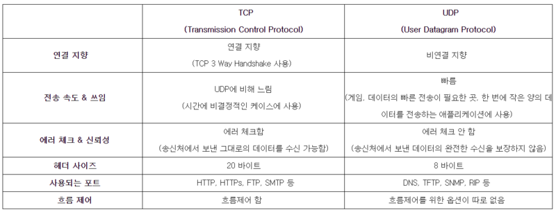

# Day37 피어세션 정리


* 서로 생각나는 개념들을 언급하고 하나로 모은 내용이므로, 틀리거나 부족한 개념이 들어있을 수 있습니다. **틀린 부분은 고쳐가면서, 혹은 지호님이 강조해주셨던 부분은 더 깊이 공부**하면서 발전시켜 보시죵~! :)

</br>
---

# 절차지향 vs 객체지향

* 개념

    1. 절차지향 - 프로시저 콜(함수 호출)의 개념을 바탕으로 한 프로그래밍 패러다임. 함수 단위로 작성하기 떄문에, 프로그램 커지면 복잡해지거나 오류가 전파될 위험이 있다. 객체 지향과 다르게 데이터와 함수가 분리된 구조

    2. 객체지향 : 캡슐화/다형성/상속/은닉성을 이용해 코드 재사용률을 증가시키고, 유지보수를 보다 쉽게 하도록 각각의 객체들을 모아 프로그래밍 하는 것. 데이터와 함수가 한데 묶여 객체로 접근한다. 재사용 및 확장에 용이하나, 처리 속도가 절차 지향에 비해 느림. 

* 주의할 점
    * 'oriented' : 지향. 추구하는 패러다임. 따라서, {C언어 vs 파이썬 == 절차 vs 객체 지향}으로 단언하기보다는, 어떤식의 관점을 가지고 코드를 구현할 것인가로 접근하는 것이 용이. 즉, 언어 종속적 개념이 아님. 

# 피보나치 수열 손코딩

* 여러분, top down방식 재귀로 끝나는게 아니고 dp배열에 담는게 핵심입니다! 아까 놓쳤네요..중복 연산을 방지하기 위해서는 dp배열에 값을 저장해 활용해야 합니다.
* 아래 코드 보기 전에 손코딩 한번 해보시죵!

https://semaph.tistory.com/16

```
int fibonacci(int n)
{
    if (n == 0) return 0;
    if (n == 1) return 1;
 
    if (dp[n] != -1) return dp[n];
 
    dp[n] = fibonacci(n - 1) + fibonacci(n - 2);
    return dp[n];
}

```

```
int fibonacci(int n)
{
    dp[0] = 0, dp[1] = 1;
    for (int i = 2; i <= n; i++)
        dp[i] = dp[i - 1] + dp[i - 2];
}
```

# TCP vs UDP 

https://m.blog.naver.com/good_ray/221984839492

- 
 - 연관지어 생각할 개념
   - OSI 7계층
   - 패킷
   - IP프로토콜 기반으로 둘다 구현되어 있음 
   - (ex) **신뢰성이 요구되는 애플리케이션에서는 TCP를 사용하고 간단한 데이터를 빠른 속도로 전송하고자 하는 애플리케이션에서는 UDP를 사용한다.** 
   - (ex) TCP - 데이터 다운로드, 파일 전송 vs UDP - 송신 신뢰성보다 실시간 스트리밍과 같이 속도가 중요한 부문에 활용
   - 헤더 정보 비교

# semaphore vs mutex

* 떠오르는 개념

    0. 운영 체제 측면에서 cpu가 자신의 리소스를 프로세스/스레드로 나눠주기 위해서는 순차성을 지켜야 할 필요가 있다. 이때 나오는 개념들 ( **멀티프로그래밍 환경에서 공유 자원에 대한 접근을 제한**하는 방법)

    1. **mutex는 binary semaphore인 반면, semaphore(공유자원의 개수를 관리)은 여러 값**을 가진다. 

    2. binary의 의미    
    mutex는 하나의 자원을 여러 작업자가 동시에 접근하지 못하도록 임계구역 진입 가능 여부를 관리한다. 

    3. example story : 철학자들의 식사, 은행 송금 내역 확인

    4. 왜 멀티프로그래밍 환경에서 공유 자원에 대한 접근을 제한할까   
        **Deadlock 발생 가능성** 언급하자. 프로세스 A,B있을 떄 A가 자원 받고자 B 끝나길 대기하는데,  B도 마찬가지. 즉 사이클 생기는 상황이라면? 서로간의 자원 해제를 무한히 기다리는 교착상태 발생. 이걸 막아야 할 필요성이 있기 때문 

# 동기 vs 비동기

* 프로세스 스레드 : 동기 비동기 관점에서는 굳이 구분해서 말할 필요는 없다. 프로세스는 사실 경량화된 프로세스

* 동기 : 동기식 처리 모델은 데이터의 요청과 결과가 한 자리에서 동시에 일어난다. 간단히 말해 사용자가 데이터를 서버에게 요청한다면 그 서버가 데이터 요청에 따른 응답을 사용자에게 다시 리턴해주기 전까지 사용자는 다른 활동을 할 수 없으며 기다려야 한다.

* 비동기 : 비동기식 처리 모델은 동기식 처리 모델과는 반대로 데이터의 요청과 결과가 동시에 일어나지 않는다. 서버에게 데이터를 요청한 후 요청에 따른 응답을 계속 기다리지 않아도되며 다른 외부 활동을 수행하여도되고 서버에게 다른 요청사항을 보내도 상관없다.

- (ex) 음악 다운받을 때, 동기적 프로그램이라면 사용자는 그 시간동안 기다리게 된다. 프로그래머 입장에서는 사용자 지연 시간을 최소화해야 하기 때문에, 다른 작업 스레드를 생성해 비동기적으로 여타 task들을 실행가능하도록 만들어야  한다.

# 프로세스와 스레드와의 관계

- 프로세스 안에 스레드
- 프로세스 vs 스레드  개념 정리해볼 것!
- (ex) 프로세스는 무겁다 (counter, register 등 독립적 메모리 영역을 다 가지고 있으므로 생성/종료/전환이 무겁다.). 반면 스레드는 한 프로세스 내의 메모리를 공유하는 부분이 있기 때문에(stack 메모리 제외) 통신 속도가 더 빠르고 생성 및 종료가 프로세스에 비해 가볍다. 프로세스간 통신할 때는 서로 간의 자원을 공유하지 않은 상태이기 때문에, IPC를 통해서 통신해야 한다. (공유 메모리, pipe, socket 등 활용)
- 프로세스는 stack, heap, code, register, counter 메모리 영역 가지는데, 스레드는 stack영역은 공유하지 않는다. 

* 즉,  **멀티스레드 프로그래밍**에서 스레드간 **스택 영역을 공유하고 있지 않기 때문에 동기화를 하지 않아도 된다. **    

   


