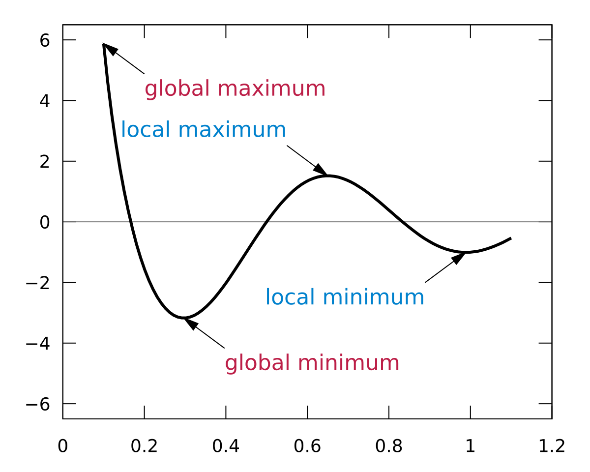

# Day38 피어세션 정리

* 복기식으로 진행한 내용이기 때문에 틀린거나 보강해야 할 내용들이 많습니다. 개인 학습때는 필요한 내용들 꼭 찾아보면서 진행합시닷 XD

# Bias vs Variance 

1. bias

   타겟값으로부터 벗어나있는 정도 (추정값 ~ 타겟값 과의 거리)

2. variance 

   데이터(추정값)들간 모여있는 정도

   

* (alpha) 두 개념 간에는 trade-off가 존재한다. bias와 variance 둘다 작게 줄이기 위해서는 학습 데이터를 늘리는 방법밖에는 없다.  

    

# 베이지안 정리의 의미

* 사전확률 p(A)  과 우도확률 p(B|A)를 안다면 사후확률 p(A|B)를 알 수있다 
  * 사전확률 분포 : 사건발생 전 사건의 원인이 될 수있는 사건들에 대한 분포
  * 사후확률 분포 : 사건 발생후 그 사건의 원인이 발생 할 수 있는 사건이 무엇인지 추정하여 그 가능성을 나타내는 변수의 분포를 의미

* 사전 확률(t) -> 사후확률(t) 이자 사전확률(t+1) -> 사후확률(t+1) 이자 사전확률(t+2) ....

*  딥러닝에서 weight와 같은 파라메터들을 **갱신**하는 과정에 베이즈 정리가 근간이 된다.  

```
(맞는 표현일까요? 쉽게 풀어서 설명한 블로그에는 이렇게 나와있었습니다.)

우리는 기존에 가지고 있었던 어떠한 '선입견'의 개념을 수치화해서 계산에 넣을 수 있습니다. 이러한 사고방식을 바로 베이지안 통계학이라고 부르며, 다양한 머신러닝 알고리즘의 근간을 이루고 있습니다. 통계적 머신러닝이란 결국 이 베이지안 통계학의 원칙 하에서, 선입견을 조금씩 수정하는 과정이라고 볼 수 있습니다.
```

# Logistic Regression

- logistic func == sigmoid func
- binary classification에 활용 (multi classification에는 softmax 활용)

# Probability vs Likelihood

* **확률**이 모델 파라미터값이 관측 데이터 없이 주어진 상태에서 랜덤한 출력이 일어날 가능성이라면, (현실 모든 발생 가능한 데이터로부터 연산)
* **가능도(likelihood)** 는 특정 관측 결과가 주어진 상태에서 모델 파라미터 값들이 나타날 가능성이다. (학습에 쓰일 수집된 데이터로부터 연산)
* 학습 데이터 수가 많아질 수록, large number theory에 의해 확률과 가능도의 값이 비슷하게 수렴한다.
* **(잘 이해 안가는 설명. 조교님께 도움을 요청합니다..)**    
  discrete한 변수에 관해서는 가능도와 확률이 거의 같은 개념이다. 반면, continuous한 변수에 관해서는 가능도가 "확률이 일어날 확률"이기 때문에 PDF(probability density function)가 된다.

# Cross-validation

0. 사용하는 이유? 

   - **보통은 train set 으로 모델을 훈련, test set으로 모델을 검증한다.**
   - 그러나 고정된 test set을 통해 모델의 성능을 검증하고 수정하는 과정을 반복하면, 결국 내가 만든 모델은 test set 에만 잘 동작하는 모델이 된다.
   - **즉, test set에 과적합(overfitting)하게 되므로, 다른 실제 데이터를 가져와 예측을 수행하면 엉망인 결과가 나와버리게 된다.**
   - 이를 해결하고자 나온 개념이 교차 검증(cross validation)
   - **교차 검증은 train set을 train set + validation set으로 분리한 뒤, validation set을 사용해 검증하는 방식이다.**

   * 딥러닝 모델 자체를 평가할 수 있으며 validation이란 개념은 결국 "하이퍼파라미터 튜닝"을 위해 사용된다는 의미. 즉 한가지의 validation set을 잘 맞추기 위한 튜닝이 아니라 다른 validation set까지도 잘 맞추기 위한 튜닝을 하기 때문에 과적합을 피할 수 있다. 

1. original cross-validation : training data의 일부를 사용하지 못해 학습할 데이터의 양이 줄어든다.   
   

2. k-fold cv : training data 전체를 학습에 모두 활용할 수 있고, validation에도 활용할 수 있다.   
   

3. time-series cv : 과거 데이터로 학습을 진행해 미래 시점의 값을 예측. 미래 데이터 값을 cheat하지 않도록 주의하며 학습시켜야 한다.   


# Ensemble 쓰는 이유

1. (비유) 집단 지성을 활용한다. 잘못된 지식(training error)이 가미되어 있더라도, 여러 사람의 지식이 합쳐지면(concatenating model => 다른 모델 간 서로의 training error 낮추는데 도움이 됨) 정답에 근접해갈 수 있다. 이는 곧 일반화 성능을 향상시킬 수 있음을 의미한다. 또한 성능을 분산시키기 때문에 과적합(overfitting) 감소 효과를 가져올 수 있다.
2. 모델은 데이터를 바라보는 구조/관점. 따라서 모델을 다양하게 사용한다(cnn/transformer/graph 등등)는 것은 데이터를 다양한 관점으로 바라본다는 의미 

3. **(+alpha. 앙상블 학습 유형(일반적으로 보팅(Voting), 배깅(Bagging), 부스팅(Boosting) 세 가지)에 대해서 피어들 모두 궁금함이 있어 조교님 도움이 필요합니다..)**

   https://injo.tistory.com/22

# 활성화 함수 종류

- 활성화 함수를 sigmoid/relu/leaky relu/softmax/tanh와 같이 non-linear한 활성화 함수들은 xor 문제를 해결하기 위해 등장했다.
- 특히 sigmoid의 대안으로 relu가 사용되는 이유에는 vanishing gradient  문제 해결, 학습 속도 향상 등이 있다.    
- 동현님 자료 발췌      
  


# Epoch, Batch_size, iteration

1. Epoch : 학습 데이터 전체를 활용해서 weight를 갱신하는 과정.
    * 1 epoch은 forward, backpropagation 과정이 한번 끝난 상태
    * epoch은 optimal 횟수를 설정하는게 중요. 
    * 즉 training error, test error 증가하다가 trainig error는 떨어지는데 test error가 계속 증가한다면 early stopping 해야 한다.    
   

2. Batch_size & iteration 

   * iteration : 한 epoch 위해 필요한 batch size 수

   * batch_size : 매개변수 업데이트 할 데이터 개수

   * 데이터가 1000개 있을때 batch_size가 10이면 1 epoch당 iteration은 100이다. batch_size와 iteration은 역의 관계. 

   


# Gradient Descent

- Gradient   
  **gradient는 현재 위치에서 가장 크게 증가하는 방향**이다. loss를 목적함수(x축 : parameter, y축 : loss)로 설정한 경우, loss가 가장 빠르게 감소하는 방향으로 학습을 진행해야 한다. 따라서 gradient를 빼주는 방식으로 파라메터를 갱신한다.

  

  

- GD 중에 때때로 Loss가증가하는 경우?

  - lr을 너무 크게 잡아서 오차값이 급격하게 늘어나는 경우      
    lr, 즉 스텝 크기가 점점 커지면, 결국에는 최소값을 지나쳐서 손실값이 더 커지는 지점까지 가게될 것이다. lr는 가장 중요한 하이퍼파라미터(hyperparameter)이라서 매우 조심스럽게 결정해야한다.   
   
     

  * 추가적으로 찾아보기

- gradient descent ~ local minimum 

  * loss function이 convex한 경우 global mimimum을 보장하고, nonconvex인 경우 local minimum을 보장한다. 정확히는 현재의 minimum point가 local인지 global인지 알 수 없게 된다. 

  


---

# 아직 논의해보지 못한 질문들


### Backpropagation 설명해보기


### Local Minima 문제에도불구하고딥러닝이잘되는이유는?**

- GD가 Local Minima 문제를피하는방법은?
- 찾은해가 Global Minimum인지아닌지알수있는방법은?


### **CNN에 대해서 아는대로 얘기하라**

- CNN이 MLP보다좋은이유는?
- 어떤 CNN의 파라메터 개수를 계산해 본다면?
- 주어진 CNN과똑같은 MLP를만들수있나?
- 풀링시에 만약 Max를 사용한다면 그 이유는?
- 시퀀스 데이터에 CNN을 적용하는 것이 가능할까?


### **Auto Encoder에대해서아는대로얘기하라**

- MNIST AE를 TF나 Keras등으로만든다면몇줄일까?
- MNIST에 대해서 임베딩 차원을 1로 해도 학습이 될까?
- 임베딩 차원을 늘렸을 때의 장단점은?
- AE 학습시항상 Loss를 0으로만들수있을까?
- VAE는무엇인가?


### **Batch Normalization의효과는?**

- Dropout의효과는?
- BN 적용해서 학습 이후 실제 사용시에 주의할 점은? 코드로는?
- GAN에서 Generator 쪽에도 BN을적용해도될까?


### **SGD, RMSprop, Adam에대해서아는대로설명한다면?**

- SGD에서 Stochastic의의미는?
- 미니배치를 작게 할때의 장단점은?
- 모멘텀의 수식을 적어 본다면?


### 딥러닝할때 GPU를쓰면좋은이유는?

- 학습중인데 GPU를 100% 사용하지않고있다. 이유는?
- GPU를두개다쓰고싶다. 방법은?
- 학습시 필요한 GPU 메모리는 어떻게 계산하는가?


