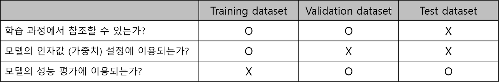
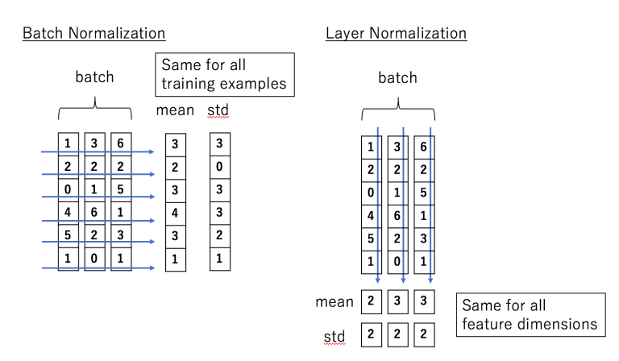

# Day39 피어세션 정리

* 혹시 조교님 말씀 중 잘못 받아적은 내용이 있거나 틀린 내용이 있다면 update해서 깃에 다시 올려주시면 감사드리겠습니다! ㅎㅎ

# K-fold Cross Validation

* k-Fold Cross Validation의 경우 한 번만 교차 검증하는 방법에 비해 시간이 오래 걸린다. 
* 하지만 **데이터가 적을 경우** 모든 데이터를 훈련 및 검증에 이용할 수 있기 때문에 의미가 있으며, 데이터가 충분할 경우에도 검증 데이터가 쏠리는 문제를 해결할 수 있다.

# Validation test set

Q. (조교님 대학원 면접때 받은 질문) test set이 있는데도 validation set을 사용하는 이유?

A.  Validation dataset과 test dataset 모두 모델 학습에 사용되지 않는다는 점, 모델의 성능 평가에 사용한다는 점은 공통된 부분이다. 그러나 validation dataset에 대한 성능은 학습을 중단하는 시점(overfitting 막기 위한 early stopping 시점)을 결정하기 위해 이용되고, test dataset은 모델의 최종 정확도를 평가하기 위해 사용된다. 

# time-series CV

* Transformer에서는 n번째 나올 단어를 예측하기 위해 n-1번째 단어까지만을 학습에 이용해야 한다. 미래 데이터를 미리 cheating해서는 안되므로 masking 처리하는 방식이 들어간다. 
* 위 맥락에서 time-series cv를 이해해볼 수 있다. 
* 시간 정보를 포함하고 있는 데이터를 일반적인 CV 방식으로 접근한다면 과거, 미래 데이터가 섞이게 되는데 이럴 경우 성능이 굉장히 잘 나오게 된다. 그러나 실제로 미래 데이터를 처리하는 성능은 떨어지게 된다. 
* 따라서 validation dataset을 train dataset보다 미래 데이터로 설정해 모델 학습(튜닝)에 이용하며 overfitting을 피할 수 있게 된다. (단, test dataset은 validation dataset보다 더 미래 데이터를 사용)
* 다만, validation set에 할당할 기간을 어떻게 설정해야 하는가에 대한 물음은 남아있다.

# local minimum

- 대부분 loss func은 non-convex하다. 즉, 현실에서는 단순히 2차 함수라고 단언할 수 없다. 따라서 global minimum을 찾으면 좋겠지만, 대부분은 local minimum에 머물게 된다. 그리고 global minimum이 무엇인지를 정의하지 못한 상태에서, 현재가 global minimum이다라고 확언할 수도 없는 상태. loss는 대부분 local minimum이라고 판단한다.
* lr 적절히 설정하는 것이 중요 : 보통은 lr을 크게 잡고 시작해 1 epoch 돌때마다 lr을 감소시켜 준다. lr이 너무 작으면 local minimum을 벗어날 수 없고, lr을 너무 크게 잡아도 drastic updates에 따라 loss가 증가해 값이 발산될 수도

# CNN 

### CNN & MLP

* 한 쪽이 성능이 좋다, 안좋다를 함부로 평가할 수 없다. 레이어 개수, 데이터 종류에 따라서 다른 관점으로 봐야 한다. 예를 들면 regression 문제에서 cnn이 mlp보다 안좋을 수 있지만 이미지 데이터라면 cnn이 더 좋을 수 있다.

*   Q. CNN을 MLP와 똑같이 만들 수 있을까?

    A. cnn filter 사이즈를 이미지 size와 동일하게 처리하면 가능할 수도 있다.

### CNN & Sequential data

* 시퀀스 데이터에 CNN을 적용할 수도 있다.
* 예를 들어 동영상은 2D인 이미지를 sequential하게 3D로 확대한 것인데,  video prediction에 CNN을 활용하기도 한다.

### max pooling > min,avg pooling?

* experimental 하게 결정할 수 있는 문제
* (ex) 흰색, 검은색 이미지 데이터가 있다면 회색값을 대표로 사용하는 것(avg pooling)이 더 합리적일 수 있다. 데이터와 task에 따라서 다르게 결정할 문제

# VAE vs AE

* VAE랑 AE는 목적 자체가 다르다. 
* AE: 데이터를 잘 압축하는 것이 목표(latent variable 학습)
* VAE: generation model (비슷해보이지만 다른 결과를 생성해내는 것)을 만드는 것이 목표

# Batch Norm

* 학습하는 과정 자체를 전체적으로 안정화한다.

* 정규화 사용하는 이유
  1. layer마다 output range가 다를 수 있는데, 정규화는 data의 범위 자체를 맞춰준다. 예를 들어 첫 레이어 input에 매우 큰 변화량이 있어도 정규화하지 않는다면 ouput의 변화량은 극소가 되어버리는 문제가 발생할 수 있어 정규화를 사용한다. 
  2. 학습을 더 빨리 하기 위해서
  3. local optimum 문제에 빠지는 가능성을 줄이기 위해서 

* BN은 학습하는 과정 자체를 전체적으로 안정화할 수 있도록 도와준다.  Gradient Vanishing / Gradient Exploding이 일어나는 문제를 방지하기 위한 아이디어
* DCGAN의 generator, discriminator에 모두 bn 적용한다.
* 그러나 너무 작은 배치 크기에서는 잘 동작하지 않거나 RNN에 적용하기 어렵다는 단점이 있다.
* batch norm vs layer norm
  * BN은 “각 feature의 평균과 분산”을 구해서 batch에 있는 “각 feature 를 정규화” 한다.
  * 반면, LN은 “각 input의 feature들에 대한 평균과 분산”을 구해서 batch에 있는 “각 input을 정규화” 한다.
  *  BN은 batch size와 관련이 깊지만 (batch 전반에 걸쳐서 처리되므로), LN은 각 input에 대해서만 처리되므로 batch size와는 전혀 상관이 없다.
  * 즉 LN은 배치 크기에 상관이 없고, 배치 레벨이 아닌 샘플 레벨에서 더 잘 작동한다.

# Stochastic Gradient

* stochastic : 확률적. 조금만 훑어보고(Mini batch) 빠르게 가자!
* 전체 데이터를 다 쓰는게 아니고 확률적으로 잘라서 쓰니까 빠르게 파라미터를 업데이트할 수 있다.
* 만개의 공통된 gradient보다, 천개씩 잘라서 구한 gradient가 더 global minimum으로 향하는 방법이 될 수 있다. 
* 단 gradient 방향이 많이 바뀌는, GD보다는 더 헤매면서 최적값을 찾아나간다는 단점이 있다. 

# GPU

* 딥러닝에 GPU를 쓰는 이유는 병렬 연산이 가능해서다. 대용량 데이터를 빠르게 처리할 수 있다. 
* 단, 병렬화 가능하게 코드를 잘 짜야 GPU를 100% 활용할 수 있다.
* GPU 두개를 사용하고자 한다면 그에 맞게 코드를 수정해야 하는데 굉장히 어렵다. 
* 파라미터 수를 계산하면(float x개, 4byte씩 차지) 대략 필요한 GPU 용량을 미리 계산할 수 있다.
* 코드 실행 중간에 지워지지 않은 텐서가 점점 쌓이면 메모리 누수가 생기므로 메모리가 터지지 않게 코드 잘 짜자!

